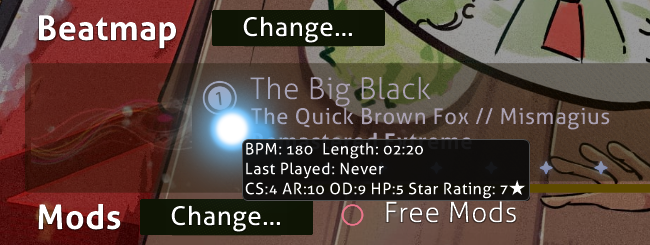
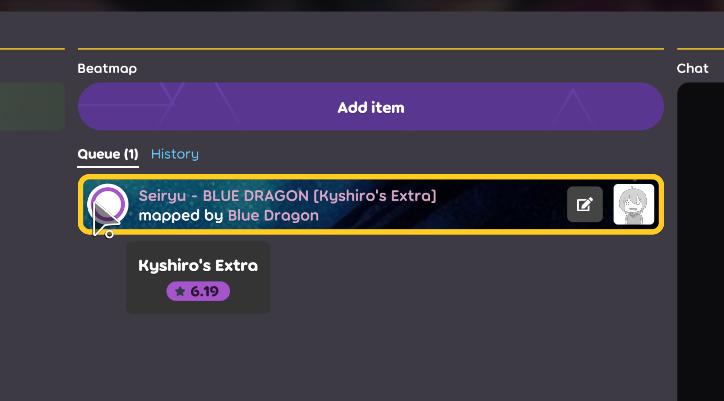
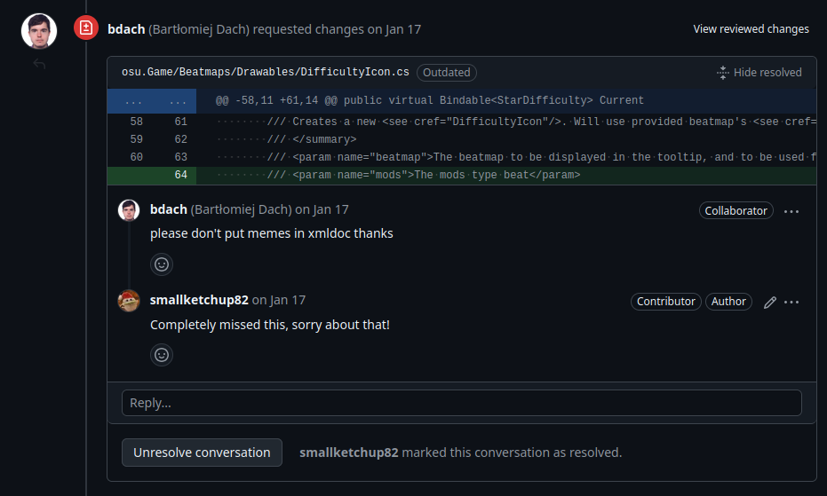
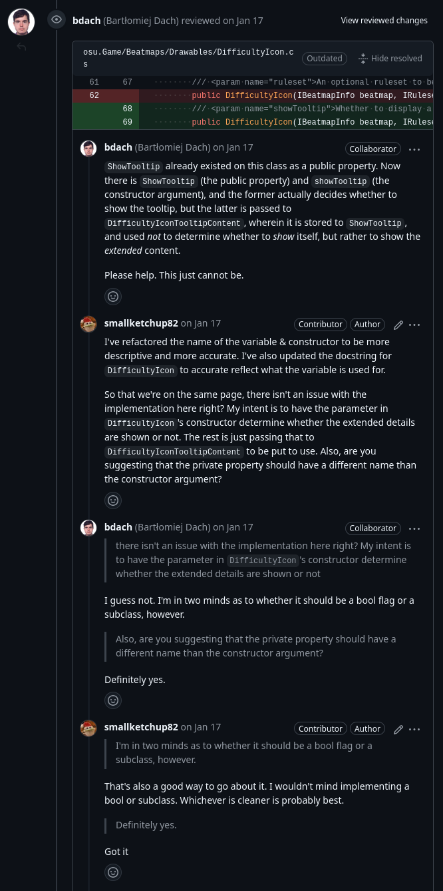
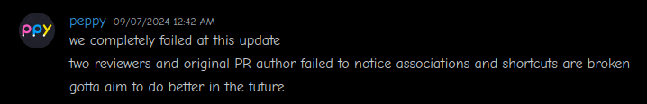

Another month another blog post. I'm coming up on a year since my first contribution to osu!, so I'd like to reflect back on my journey in this blog post.
## Prelude
I remember back then, I never really thought of contributing to osu!. It always seemed like such a large undertaking that only really exceptional developers could dream of doing. Hence, there was only one way I ended up with my first contribution.

In osu! stable, hovering over the currently selected song in a multiplayer lobby shows a tooltip with difficulty information.

In lazer, this did not exist.

I would be playing with my friends and never have a clue as to what the difficulty of the map was until I clicked on it. And even then, the stats would be inaccurate the second you put a mod on the map. So, I decided that I'd try and add it myself.

At this point in time, I had only basic experience using C#. I programmed a discord bot in Discord.Net and that was about it. My only saving grace was that I knew Git. And so, I forked the osu!(lazer) repository and got to work. Admittedly, I had no idea what I was doing. I spent probably a week trying to figure out how to add a tooltip to the song select. I had no idea how the codebase was structured or how any of the UI logic even worked. But I was determined to get it done cause of how much it annoyed me to not have. Eventually, I got it working and submitted my first PR.

## [My first Pull Request](https://github.com/ppy/osu/pull/26531)
Contrary to what a lot of others might've experienced, I wasn't actually nervous when submitting my first PR. Mostly because I didn't really understand the magnitude of what I was doing. I was just happy to have gotten it working. So, without even testing it or reviewing the diff, I submitted my PR without a second thought. And then I waited.

And then, the review came.

And even worse..

For those that don't know what I just did here, I created an instance variable with the same name as another instance variable, with the only difference being the capitalization of the first letter, and both variables serving entirely different purposes.

It doesn't help that I used to name my variables `poop`, `fart`, and `shit` in rough drafts either.  Truly, this was a masterpiece of a PR.

When I got the review, I was obviously embarrassed. I had only myself to blame for not reviewing my own code before submitting it. But, I was also grateful. The reviewer got to the point and told me exactly what was wrong with my code. I fixed it and re-requested review. While the PR was still a mess, it got merged and I was pretty happy with myself. I had just contributed to osu!, something I never thought I'd be able to do, and it was pretty cool.

## [The next PR](https://github.com/ppy/osu/pull/26658)
After my first PR, I was pretty hooked. I wanted to contribute more and learn more about osu!'s codebase. So, I started thinking of what I could do next. At that time, lazer was in the primitive era of not having file associations on windows. You had to manually drag and drop files into the lazer window to import them. So, I decided that I'd try and add file associations to lazer.

Given I'm more of a software engineer than a game developer, this was rather easy for me to do. The hard part was doing it well.

I remember spending a lot of time discussing design decisions on this feature. I really wanted lazer to integrate itself as another option alongside stable, but not necessarily take priority over stable. The team was basically the opposite. They wanted lazer to be the default option and stable to be the secondary option. I remember being pretty stubborn about this.

Eventually, another contributor came in, improved my PR, and made lazer the default option. That PR was the one that got merged. I was bummed out that my PR didn't get merged, and that I didn't really get any credit for the feature. But, I realized that's just how open-source works. It's not about getting credit, it's about contributing to something you care about. At the end of the day, I was happy that the feature I wanted to see in lazer was finally there.

## [My biggest PR](https://github.com/ppy/osu/pull/27793)
After the file associations PR, I was pretty confident in my abilities. I had contributed 2 times to osu! and learned a lot in the process. So, I decided to tackle something I really wanted to see in lazer. This being Audio Normalization.

It's too big of a feature to explain in this blog post, so if you want the descriptions of the feature, you can read the PR description.

This PR was a LOT of work. I spent probably a month working on it. The first week was spent just trying to sort out dependencies. The next week was spent trying to diagnose and fix a bug that turned out to be caused by an outdated version of BASS. The other 2 weeks were spent actually implementing the feature.

I remember being especially proud of this PR. It was the best of my abilities, and the best of my ideas. It was so good that I spent an entire week playing on my branch instead of on the public release. But, I learnt another lesson from this PR. The time it takes to get a PR merged increases exponentially with the size of the PR. At the time of writing this blog post, the PR is still open and has been for 6 months.

Regardless, I've kept the PR clean. Another person, hwsmm, came in and submitted a PR on my fork that heavily improved the feature. After that, the PR was much simpler and easier to understand. I'm grateful for that.

## [An interlude](https://github.com/ppy/osu/issues/18902)
Seeing as my Audio Normalization PR wasn't getting any attention, I decided to work on something else in the meantime. This time around, I had no idea what I wanted to work on. So, I decided to ask some of my friends. They suggested I work on a feature that lets you mount a skin's files in a folder, so you can edit the files without having to extract the skin and re-zip it. I thought it was a pretty cool idea, so I got to work.

I asked about taking it on in the issue thread, but peppy told me to work on implementing it for beatmaps because that would be a lot more useful than skins. I reluctantly agreed and got to work.

This feature was pretty uneventful, except for when I ended up with a bug where I was duplicating the `files` directory and wasn't noticing it. I couldn't figure out what the problem was, and eventually posted to the issue thread saying I intended on throwing in the towel. But, peppy noticed the issue and set me straight.

I fixed the bug, but didn't get around to polishing my branch and finishing the PR. It stayed stale for a couple of months until peppy asked me if he could take over the PR. I agreed, and he got it merged in.

## [An even bigger PR](https://github.com/ppy/osu-deploy/pull/171)
I didn't really intend on working on anything else until my Audio Normalization PR got merged. But of course, I ended up working on something else.

I was casually reading the osu!dev discord when I saw a [message from kurumi gaming](https://discord.com/channels/188630481301012481/1097318920991559880/1255510707655544956) about moving the lazer updater to Velopack. This caught my eye, because again, I'm more of a software engineer than a game developer. This was something I could do.

Given my last PR was relatively big and spanned a bunch of different repositories and files, I had some experience on how I should approach this feature. Additionally, I had to deal with Squirrel (lazer's old updater) in my File Associations PR, and it was nothing but a nightmare. So I really really wanted to see Velopack in lazer.

I began by reading the Velopack docs and running through the steps on migrating from Squirrel to Velopack. This feature had a lot of moving pieces and even required changes from Velopack itself. I won't go into too much detail about developing the feature, but I'll give a brief overview.

The hardest part of it was rewriting `osu-deploy` to use Velopack instead of Squirrel. Given that I only had a couple months of experience with C#, the code was a mess. Smoogipoo (a core osu developer) ended up refactoring most of the code eventually. I'm really sorry smoogi!

After osu-deploy was rewritten, I had to make changes to the osu! codebase to use Velopack instead of Squirrel. This was relatively easy, but I had to make sure that the changes I made didn't break anything. Testing wasn't easy either, it required a bunch of work with virtual machines and a bunch of time investment. So, I didn't test it. I just submitted the PR.

As you can guess, shit hit the fan. As with my first PR, not testing your code is a free gateway to programmer hell. Me, Smoogi, and peppy tested both PR's and peppy merged them in.

But, it turns out we overlooked many things. There were a bunch of issues, but one that really sent a shiver down my spine.

Turns out, we accidentally left the package title of lazer as `osu!`, not `osu!(lazer)`. Meaning when people installed the release, lazer would **completely overwrite stable's shortcuts with it's own**, meaning players would have to locate and manually run the stable executable to launch stable. And since everyday user's don't know how to do that, it effectively bricked people's osu! stable installation.

This was a complete and utter failure of the highest calibre. It was fixed by smoogi in a matter of hours. But issues would continue to come in. As it turns out, associations broke too, as I forgot add in the association updating code. And peppy was not happy with any of this..

I really had nothing to say to this. I was just really sorry. All of the confidence I had gained from my previous PR's was gone. This was a huge failure on my part, and the only thing I could think of was how I could set things right.

I spent the next couple of days fixing all of the issues I could. I ended up fixing some long standing issues with lazer (lack of a icon for beatmap files and lazer showing up as osu! in windows menu's) as a bonus. I made sure to test everything this time after peppy told me that it was unacceptable to not test my code before submitting it in a review for the PR I made fixing associations.

All of these PR's got merged in, and I was happy that I was given a chance to make things right. I'm grateful for the osu! team for being so understanding and patient with me. I'm also grateful for the community for being so supportive of me. I'm really sorry for the issues I caused, and I hope to not make the same mistakes again. Though, I make no promises.

In the end, everything worked out. My name was mentioned in the update video, I got a bunch of experience, and I got to contribute a big feature to osu!. All in all, it was worth it.

## [My current PR](https://github.com/ppy/osu/pull/30226)
Remember when I said I was working on a feature that lets you mount a beatmap's files in a folder? Do you also remember that I originally intended on doing this for skins? Well, I haven't forgotten about that. I've finally gotten to it, and I'm working on getting it merged in. I've made sure to test everything this time, and I'm hopeful that it'll get merged in with less effort than my last PR.

## Conclusion
Looking back on the past year, I've learnt a lot. I really like C#, and I really like contributing to osu!. I still feel nervous when submitting PR's, but I've gotten better at it. With every PR I submit, I learn something new, and the process becomes easier. I'm grateful for the osu! team for being so understanding and patient with me. I hope that my efforts thus far have been useful to the project, and I hope to continue contributing to osu! in the future. Maybe in a couple of years, I'll be a core developer. Who knows?

That's all for this blog post. Thanks for reading this far! I'll see you in the next one.